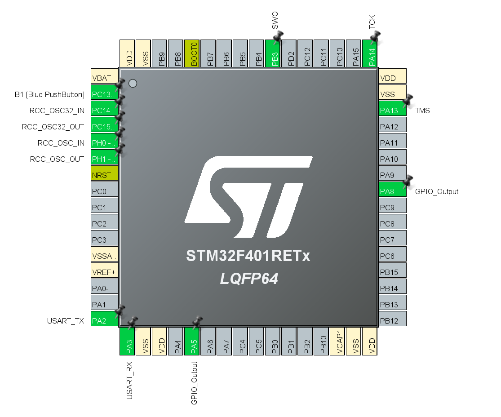
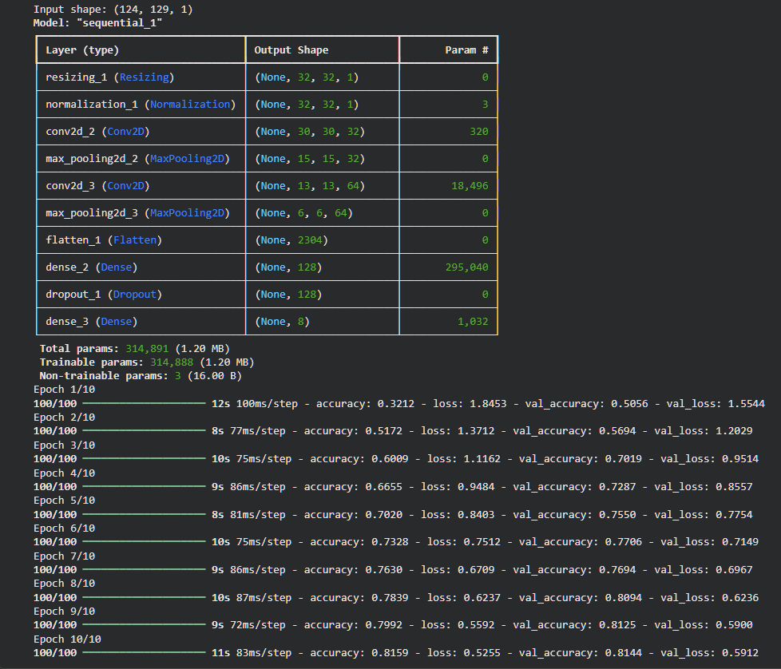
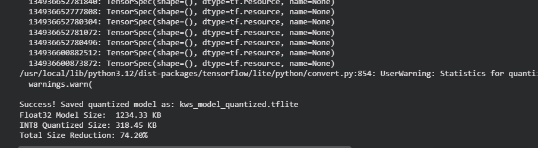
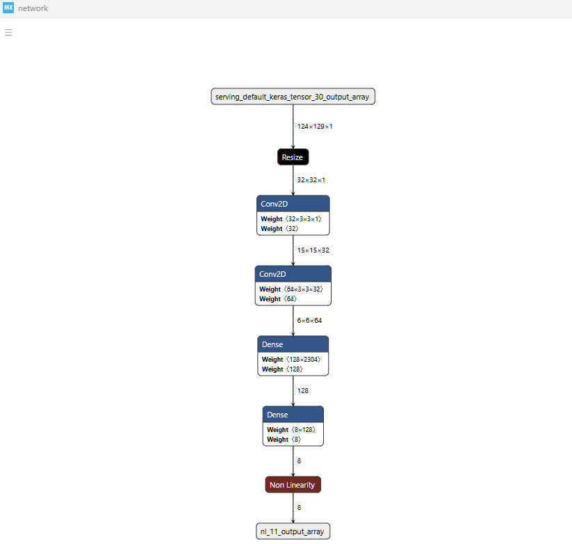
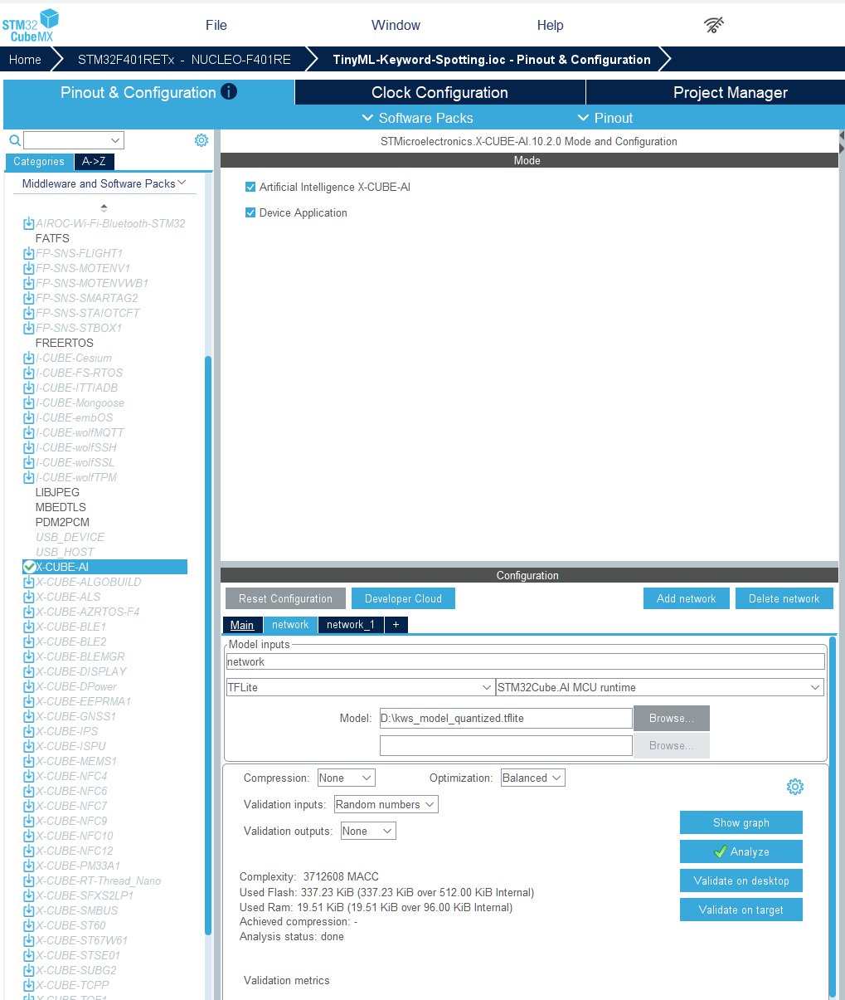
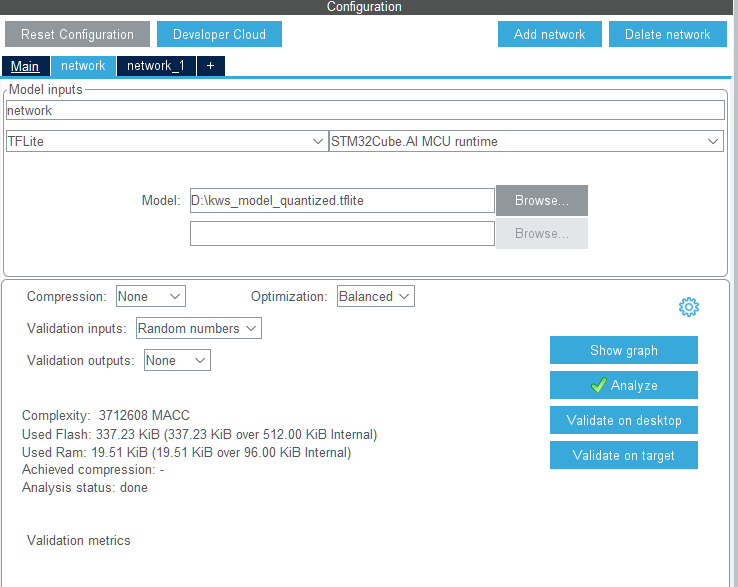
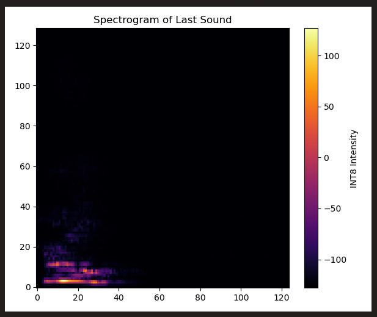
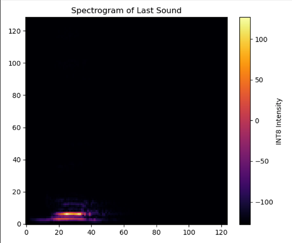
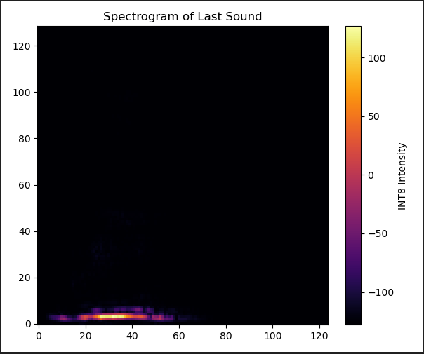
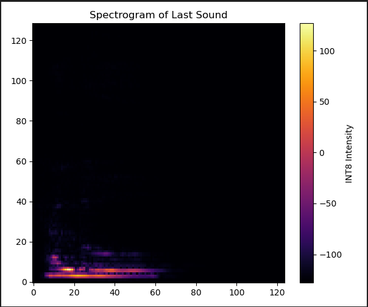

# 🎙️ TinyML Keyword Spotting: Hardware-in-the-Loop Edge AI on STM32

A bare-metal embedded machine learning pipeline that runs an 8-bit quantized Convolutional Neural Network (CNN) on an STM32 microcontroller to detect spoken keywords. 

## The Plan & Objective
The goal of this project was to deploy a custom Keyword Spotting (KWS) AI model onto a constrained microcontroller without an operating system. 

**The Catch:** I did not have an external I2S MEMS microphone available for the STM32. 
**The Solution:** Instead of waiting for hardware, I engineered a **Hardware-in-the-Loop (HITL)** architecture. I used my laptop's microphone and wrote a Python script to actively listen, process the audio, and stream the data over a USB COM port (UART) directly into the STM32's memory for real-time inference.

  

---

## Step 1: Model Training & Quantization
I trained a CNN on the Google Speech Commands dataset to recognize 8 distinct categories (e.g., "go", "stop", "up", "down", "yes", "no", "left", "right"). 

  

To make this fit on an STM32F4 (which has very limited RAM and Flash), the model couldn't stay as standard 32-bit floats. 
1. **Feature Engineering:** The model was trained on 124x129 Short-Time Fourier Transform (STFT) Spectrograms rather than raw audio waveforms.
2. **Quantization:** I converted the model to TensorFlow Lite and applied Post-Training Quantization to crush the weights from `float32` down to `int8`. This reduced the model size drastically while maintaining accuracy.

  

  

---

## Step 2: X-CUBE-AI Integration
Using STMicroelectronics' X-CUBE-AI expansion pack, I imported the `.tflite` model directly into STM32CubeIDE. The tool analyzed the neural network and generated the necessary optimized C code to run the layers on the ARM Cortex-M4 processor.

  

  

---

## Step 3: Firmware & The C++ Conversion
I prefer writing application logic in C++ for better object-oriented structure. I renamed the auto-generated `main.c` to `main.cpp`, but immediately hit massive **Linker Errors**. 

**The Problem:** The X-CUBE-AI engine is generated in pure C. When the C++ compiler tried to link the AI functions, it mangled the names, causing `undefined reference` errors.
**The Solution:** I wrapped the AI library includes and initialization functions inside `extern "C"` blocks within my `main.cpp` file. This successfully bridged the C++ application code with the C AI libraries.

---

## Step 4: Python Hardware-in-the-Loop Bridge
Because the STM32 didn't have a microphone, I wrote a Python script to act as the "Ears".
1. Python continuously listens to the laptop mic using `pyaudio`.
2. Upon detecting a volume spike, it records exactly 1 second of audio (16,000 samples).
3. It uses TensorFlow to compute a 124x129 STFT Spectrogram.
4. It normalizes and quantizes the spectrogram to `INT8` (-128 to 127).
5. It blasts the resulting 15,996 bytes over the USB Serial port (`pyserial`) to the STM32 at 115200 baud.

Here are examples of the visual spectrograms my script generates right before sending them to the MCU:

  

  

  

  

---

## The Debugging Journey (Problems Faced & Solved)

Building this from scratch exposed me to several low-level embedded traps:

### 1. The Silent HardFault (CRC Clock Issue)
* **Problem:** Every time I triggered the AI inference, the STM32 would completely crash and freeze. The LED would turn on and never turn off. 
* **Solution:** X-CUBE-AI silently requires the hardware CRC (Cyclic Redundancy Check) module to be enabled to verify memory. The IDE didn't turn it on in my `main.cpp` automatically. I solved this by manually adding `__HAL_RCC_CRC_CLK_ENABLE();` before AI initialization.

### 2. The ST Template "Death Trap"
* **Problem:** The default X-CUBE-AI `MX_X_CUBE_AI_Process()` template code includes a `do-while(res==0)` loop that traps the processor in an infinite loop if the data isn't perfectly pre-processed by their dummy functions. 
* **Solution:** I completely gutted the wrapper function and forcefully injected my own memory copy (`memcpy`) to feed the input buffer, calling `ai_run()` directly.

### 3. The "Deaf AI" (Raw Audio vs. Spectrogram)
* **Problem:** Initially, Python was sending the raw 1D audio waveform over USB. The STM32 received it and ran the math, but guessed Class 0 ("Silence/Unknown") every single time. 
* **Solution:** I realized my Keras model wasn't trained on raw audio; it was trained on 2D image heat-maps (124x129). Shoving raw audio into an image-based CNN looked like pure static to the AI. I rewrote the Python script to execute the STFT math *before* sending the data to the MCU.

---

## Functionality & Current Hardware Behavior
**How it works:**
1. You say "Go" into the laptop microphone.
2. Python builds the spectrogram and sends it to the Nucleo board over USB.
3. The STM32 reads the data into its AI Input Buffer, runs the Neural Network inference, and finds the highest probability output array index.
4. The STM32 blinks its on-board green LED to communicate the predicted class (e.g., 2 blinks for "Go", 6 blinks for "Stop").

**Why it is still "Not Optimal":**
While the AI math is lightning fast, the system architecture has a bottleneck. Sending 15,996 bytes over a 115200 baud UART connection takes roughly ~1.4 seconds. Because I am using a blocking `HAL_UART_Receive` call, the processor sits idle waiting for the USB transfer to finish before it can run the AI. 

**Future Improvements:**
To make this truly production-ready, I plan to:
1. Attach a physical I2S MEMS microphone directly to the STM32.
2. Port the STFT feature extraction logic from Python into C so the STM32 can generate its own spectrograms.
3. Use DMA (Direct Memory Access) for UART/I2S transfers so the CPU can calculate neural network layers while simultaneously listening to the next audio sample!